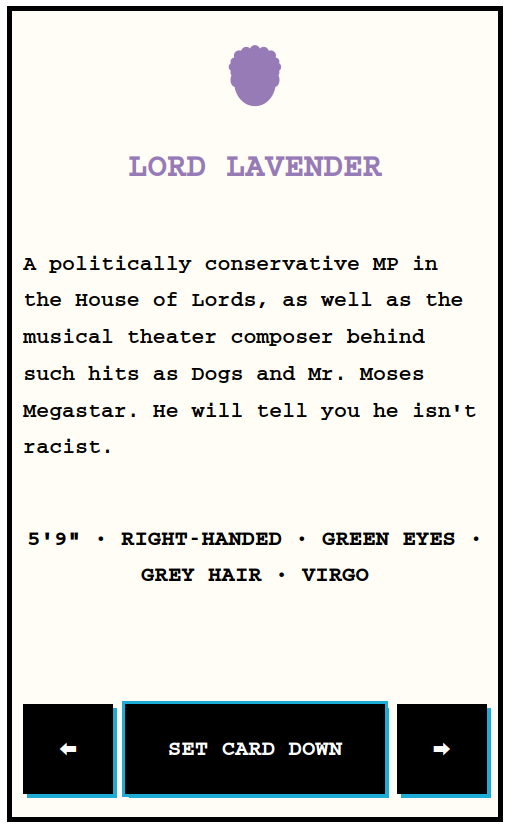

# Murdle Cards

Cards used in [Murdle](https://gtkmysteries.com/murdle/), with some improvements

## Table of contents

- [General info](#general-info)
- [Screenshots](#screenshots)
- [Technologies](#technologies)
- [Setup](#setup)
- [Status](#status)

## General info

I love Murdle, but the cards have some annoyances. Here I am recreating them and fixing those annoyances.

Annoyances:

- Big cards not all being the same height
- Unable to use escape key to close big cards
- Unable to go to previous big card
- Unable to use arrows to go between big cards

## Screenshots




## Technologies

- React
- Vite
- Vitest
- CSS
- Cypress

## Setup

To view this project visit the demo TBC or download the files, open a terminal in that folder and install locally using npm:

```
npm install
```

Run the app locally:

```
npm run dev
```

## Status

Project is: _finished_
